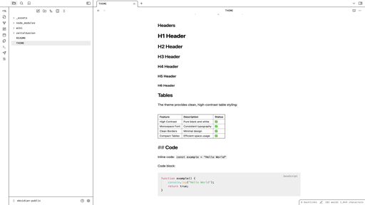

# Mono High Contrast Theme

A high contrast theme for Obsidian, inspired by VS Code's default high contrast theme.

## Features

- Clean and minimal design
- VSCode look and feel

## Usage

1. Open Obsidian
2. Go to Settings > Appearance
3. Under "Themes", click "Manage"
4. Click "Browse" and search for "Mono High Contrast"
5. Click "Install"
6. Select the theme from the dropdown menu

## License

MIT License - see LICENSE file for details
